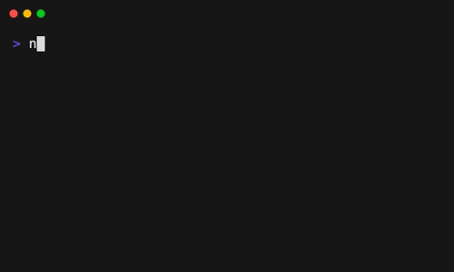

# ConsoleTasks

ConsoleTasks is a flexible NodeJs library for managing and displaying concurrent or sequential tasks in the console. It provides a clean and intuitive API for creating, executing, and monitoring tasks with a highly configurable and visually appealing progress display.

## Features

- Concurrent and sequential task execution
- A task completely owns its rendering in the console UI
- Task status updates (running, successful, failed, or cancelled)
- Easily customizable spinners for all or specific tasks
- Support for dynamic task creation
- Graceful handling of task cancellation
- TypeScript support for enhanced type safety

## Installation

To install ConsoleTasks, use npm:

```bash
npm install console-tasks
```

Or with yarn:

```bash
yarn add console-tasks
```

## Basic Usage

Here's a basic example of how to use ConsoleTasks:

```typescript
import { Task, TaskManager } from 'console-tasks';

// Define a task
const exampleTask: Task = {
  initialMessage: "Starting example task...",
  task: async (updateFn, abortSignal) => {
    await new Promise((resolve) => setTimeout(resolve, 2000)); // Simulate async work
    updateFn("Example task in progress...");
    await new Promise((resolve) => setTimeout(resolve, 2000)); // More async work
    updateFn("Example task completed!");
  },
};

// Create a TaskManager instance
const taskManager = TaskManager.getInstance({ title: " Example " });

// Add and execute the tasks in parallel.
taskManager.add(exampleTask, exampleTask, exampleTask);
await taskManager.run();
```
Which results in this



## Contributing

Contributions are welcome! Please feel free to submit a Pull Request.

## License

This project is licensed under the MIT License.